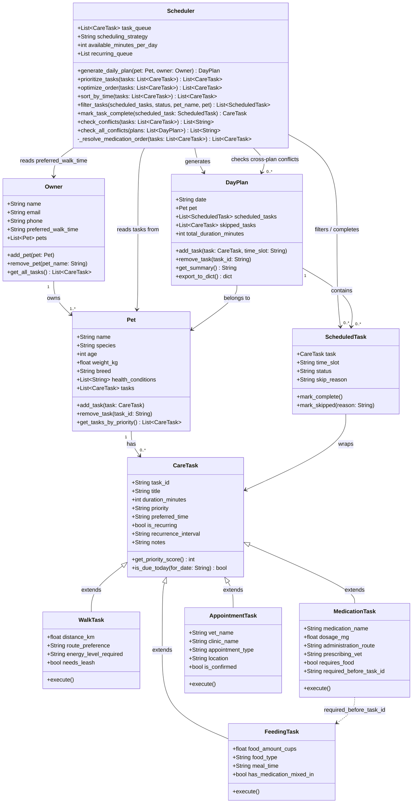

# PawPal+ Class Diagram (Final)

```mermaid
---
id: 8fc45384-6fd8-44ce-a369-640ab0f6f25a
---
classDiagram
    class Owner {
        +String name
        +String email
        +String phone
        +String preferred_walk_time
        +List~Pet~ pets
        +add_pet(pet: Pet)
        +remove_pet(pet_name: String)
        +get_all_tasks() List~CareTask~
    }

    class Pet {
        +String name
        +String species
        +int age
        +float weight_kg
        +String breed
        +List~String~ health_conditions
        +List~CareTask~ tasks
        +add_task(task: CareTask)
        +remove_task(task_id: String)
        +get_tasks_by_priority() List~CareTask~
    }

    class CareTask {
        +String task_id
        +String title
        +int duration_minutes
        +String priority
        +String preferred_time
        +bool is_recurring
        +String recurrence_interval
        +String notes
        +get_priority_score() int
        +is_due_today(for_date: String) bool
    }

    class FeedingTask {
        +float food_amount_cups
        +String food_type
        +String meal_time
        +bool has_medication_mixed_in
        +execute()
    }

    class WalkTask {
        +float distance_km
        +String route_preference
        +String energy_level_required
        +bool needs_leash
        +execute()
    }

    class MedicationTask {
        +String medication_name
        +float dosage_mg
        +String administration_route
        +String prescribing_vet
        +bool requires_food
        +String required_before_task_id
        +execute()
    }

    class AppointmentTask {
        +String vet_name
        +String clinic_name
        +String appointment_type
        +String location
        +bool is_confirmed
        +execute()
    }

    class ScheduledTask {
        +CareTask task
        +String time_slot
        +String status
        +String skip_reason
        +mark_complete()
        +mark_skipped(reason: String)
    }

    class DayPlan {
        +String date
        +Pet pet
        +List~ScheduledTask~ scheduled_tasks
        +List~CareTask~ skipped_tasks
        +int total_duration_minutes
        +add_task(task: CareTask, time_slot: String)
        +remove_task(task_id: String)
        +get_summary() String
        +export_to_dict() dict
    }

    class Scheduler {
        +List~CareTask~ task_queue
        +String scheduling_strategy
        +int available_minutes_per_day
        +List recurring_queue
        +generate_daily_plan(pet: Pet, owner: Owner) DayPlan
        +prioritize_tasks(tasks: List~CareTask~) List~CareTask~
        +optimize_order(tasks: List~CareTask~) List~CareTask~
        +sort_by_time(tasks: List~CareTask~) List~CareTask~
        +filter_tasks(scheduled_tasks, status, pet_name, pet) List~ScheduledTask~
        +mark_task_complete(scheduled_task: ScheduledTask) CareTask
        +check_conflicts(tasks: List~CareTask~) List~String~
        +check_all_conflicts(plans: List~DayPlan~) List~String~
        -_resolve_medication_order(tasks: List~CareTask~) List~CareTask~
    }

    Owner "1" --> "1..*" Pet : owns
    Pet "1" --> "0..*" CareTask : has

    CareTask <|-- FeedingTask : extends
    CareTask <|-- WalkTask : extends
    CareTask <|-- MedicationTask : extends
    CareTask <|-- AppointmentTask : extends

    MedicationTask ..> FeedingTask : required_before_task_id

    Scheduler --> Pet : reads tasks from
    Scheduler --> Owner : reads preferred_walk_time
    Scheduler --> DayPlan : generates
    Scheduler --> "0..*" ScheduledTask : filters / completes
    Scheduler --> "0..*" DayPlan : checks cross-plan conflicts

    DayPlan "1" --> "0..*" ScheduledTask : contains
    DayPlan --> Pet : belongs to

    ScheduledTask --> CareTask : wraps
```
